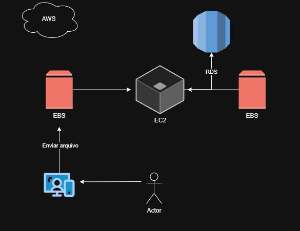

# ☁️ Arquitetura AWS – Fluxo de Armazenamento e Processamento de Dados

Este projeto apresenta uma arquitetura simplificada de armazenamento e processamento de dados utilizando os principais serviços da **Amazon Web Services (AWS)**: **EC2**, **EBS** e **RDS**.

---

## 🧩 Visão Geral

O diagrama representa o fluxo básico de interação entre um **usuário** e uma **aplicação hospedada na AWS**, desde o envio de um arquivo até seu armazenamento e registro no banco de dados.

---

## ⚙️ Componentes Principais

### 👤 Usuário (Actor)
Representa o cliente que interage com a aplicação — enviando arquivos, formulários ou dados.

### 💻 Aplicação
Interface web ou sistema cliente que o usuário acessa para enviar os dados para processamento.

### 🖥️ EC2 (Elastic Compute Cloud)
Instância de computação na nuvem responsável por:
- Receber e processar os arquivos enviados;
- Gerenciar o fluxo entre armazenamento (EBS) e banco de dados (RDS);
- Retornar respostas para a aplicação.

### 💾 EBS (Elastic Block Store)
Armazenamento em blocos persistente, conectado à instância EC2.  
Utilizado para guardar arquivos, dados intermediários ou backups.

### 🗄️ RDS (Relational Database Service)
Banco de dados relacional gerenciado pela AWS.  
Responsável por armazenar informações estruturadas, como:
- Registros de usuários;
- Metadados dos arquivos;
- Logs e estatísticas.

---

## 🔄 Fluxo do Processo

1. O **usuário** envia um arquivo pela **aplicação**.  
2. A **instância EC2** recebe e processa o arquivo.  
3. O arquivo é armazenado em um **volume EBS**.  
4. As informações associadas (como nome, data, status, etc.) são gravadas no **RDS**.  
5. A EC2 retorna uma **resposta** à aplicação, confirmando o processamento.  

---

## ☁️ Benefícios da Arquitetura

- **Escalabilidade:** os recursos EC2, EBS e RDS podem crescer conforme a demanda.  
- **Resiliência:** dados armazenados de forma persistente e segura.  
- **Integração:** serviços AWS se comunicam de forma nativa e gerenciada.  
- **Custo sob demanda:** paga-se apenas pelo uso dos recursos.

---

## 🧠 Tecnologias Utilizadas

| Categoria | Serviço | Função |
|------------|----------|--------|
| Computação | Amazon EC2 | Execução da aplicação |
| Armazenamento | Amazon EBS | Persistência de arquivos e dados temporários |
| Banco de Dados | Amazon RDS | Armazenamento de dados estruturados |
| Nuvem | AWS | Infraestrutura e gerenciamento |

---

## 📘 Referências
- [Documentação Amazon EC2](https://docs.aws.amazon.com/pt_br/ec2/)
- [Documentação Amazon EBS](https://docs.aws.amazon.com/pt_br/ebs/)
- [Documentação Amazon RDS](https://docs.aws.amazon.com/pt_br/rds/)