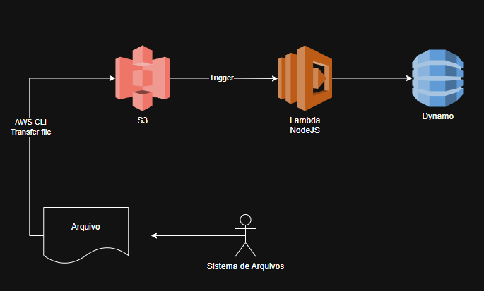

# Arquitetura Serverless AWS – Upload e Processamento Automático de Arquivos

Este projeto demonstra uma arquitetura **serverless** construída na **Amazon Web Services (AWS)** para realizar **upload, processamento e armazenamento de informações** de forma automatizada, sem a necessidade de gerenciar servidores.

## Visão Geral

O fluxo inicia com o **envio de um arquivo** para o serviço **Amazon S3**, que aciona automaticamente uma **função Lambda** desenvolvida em **Node.js**.  
Essa função processa os dados e armazena as informações no **banco de dados DynamoDB**.

## Componentes Principais

### 📁 Sistema de Arquivos / Usuário
Origem dos arquivos a serem enviados.  
Os arquivos podem ser transferidos manualmente ou via terminal usando o **AWS CLI**.

### ☁️ Amazon S3 (Simple Storage Service)
Serviço de armazenamento de objetos na nuvem.  
Responsável por:
- Armazenar os arquivos enviados;
- Acionar automaticamente uma função Lambda (por meio de *event triggers*);
- Garantir durabilidade e segurança dos dados.

### ⚡ AWS Lambda (Node.js)
Função **serverless** executada sob demanda quando um novo arquivo é adicionado ao S3.  
Responsável por:
- Ler os metadados do arquivo;
- Processar e transformar os dados (por exemplo, extrair informações do nome ou conteúdo);
- Inserir as informações processadas no banco de dados **DynamoDB**.

### 🗃️ Amazon DynamoDB
Banco de dados **NoSQL** totalmente gerenciado.  
Utilizado para armazenar:
- Metadados dos arquivos (nome, data, usuário, tipo);
- Logs de processamento;
- Resultados gerados pela função Lambda.

## 🔄 Fluxo do Processo

1. O **usuário** envia um **arquivo** para o bucket **S3** (manual ou via AWS CLI).  
2. O **S3** detecta o novo arquivo e dispara automaticamente um **gatilho (trigger)**.  
3. A **função Lambda** é executada, processa os dados e interage com o **DynamoDB**.  
4. O **DynamoDB** armazena as informações relevantes sobre o arquivo.  
5. (Opcional) A Lambda pode enviar uma notificação, log ou resposta ao usuário.

## Benefícios da Arquitetura

- **100% Serverless:** sem necessidade de gerenciar instâncias EC2.  
- **Alta escalabilidade:** a Lambda processa automaticamente qualquer volume de arquivos.  
- **Custo sob demanda:** paga-se apenas pelo uso real dos serviços.  
- **Integração nativa:** os serviços AWS se comunicam de forma automática e segura.  
- **Alta durabilidade e disponibilidade.**

---

## Tecnologias Utilizadas

| Categoria | Serviço AWS | Função |
|------------|--------------|--------|
| Armazenamento | Amazon S3 | Recebe e guarda arquivos |
| Processamento | AWS Lambda (Node.js) | Executa a lógica de processamento |
| Banco de Dados | Amazon DynamoDB | Armazena metadados e resultados |
| Ferramenta de Transferência | AWS CLI | Envio automatizado de arquivos |

---

## 📘 Referências
- [Amazon S3 – Documentação Oficial](https://docs.aws.amazon.com/pt_br/AmazonS3/latest/userguide/Welcome.html)  
- [AWS Lambda – Guia do Desenvolvedor](https://docs.aws.amazon.com/pt_br/lambda/latest/dg/welcome.html)  
- [Amazon DynamoDB – Introdução](https://docs.aws.amazon.com/pt_br/amazondynamodb/latest/developerguide/Introduction.html)  
- [AWS CLI – Ferramenta de Linha de Comando](https://docs.aws.amazon.com/pt_br/cli/latest/userguide/cli-chap-welcome.html)  

