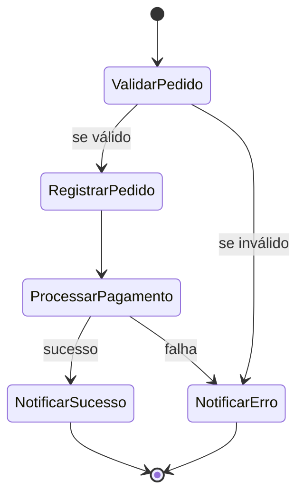

# Processador de Pedidos com AWS Step Functions

## 🎯 Objetivo
Este projeto tem como objetivo demonstrar o uso do **AWS Step Functions** para orquestrar o fluxo de processamento de pedidos, integrando funções **AWS Lambda**.

---

## ⚙️ Arquitetura
O fluxo é composto pelas seguintes etapas:
1. **Validar Pedido** – verifica se o pedido contém os campos obrigatórios.
2. **Registrar Pedido** – simula o salvamento no banco de dados DynamoDB.
3. **Processar Pagamento** – simula uma aprovação ou reprovação.
4. **Notificar Resultado** – informa o status final do pedido.

---

## 🧩 Serviços Utilizados
- AWS Step Functions
- AWS Lambda
- Amazon DynamoDB (simulado)


---

## 🧪 Exemplo de Input

```json
 {
  "pedidoId": "123",
  "nomeCliente": "Ingrid",
  "valor": 120.5
}  
```

Se tudo ocorrer bem, o output esperado será:

## ✅ Exemplo de Output (sucesso)

```json
{
  "pedidoId": "123",
  "nomeCliente": "Ingrid",
  "valor": 120.5,
  "status": "PAGAMENTO_APROVADO",
  "statusFinal": "SUCESSO"
}
```

## 🧠 Códigos das Funções Lambda

### 🔹 `validar_pedido.js`
```js
exports.handler = async (event) => {
    console.log("Validando pedido:", event);

    if (!event.pedidoId) {
        throw new Error("Pedido inválido: falta o pedidoId");
    }

    return {
        ...event,
        status: "VALIDADO"
    };
};
```

---

### 🔹 `registrar_pedido.js`
```js
exports.handler = async (event) => {
    console.log("Registrando pedido:", event);

    // Simula geração de um ID de pedido único, se não existir
    const pedidoId = event.pedidoId || Date.now().toString();

    return {
        ...event,
        pedidoId,
        status: "REGISTRADO"
    };
};
```

---

### 🔹 `processar_pagamento.js`
```js
exports.handler = async (event) => {
    console.log("Processando pagamento do pedido:", event.pedidoId);

    // Simula aprovação ou recusa do pagamento (70% de chance de aprovação)
    const aprovado = Math.random() > 0.3;

    if (!aprovado) {
        throw new Error("Pagamento recusado");
    }

    return {
        ...event,
        status: "PAGAMENTO_APROVADO"
    };
};
```

---

### 🔹 `notificar_sucesso.js`
```js
exports.handler = async (event) => {
    console.log("Pedido processado com sucesso:", event.pedidoId);

    return {
        ...event,
        statusFinal: "SUCESSO"
    };
};
```

---

### 🔹 `notificar_erro.js`
```js
exports.handler = async (event) => {
    console.error("Ocorreu um erro no processamento do pedido:", event);

    return {
        ...event,
        statusFinal: "ERRO"
    };
};
```


## 🧭 Como Testar o Projeto

1. Crie as funções Lambda no **Console da AWS** com os códigos acima.  
2. Crie a **State Machine** no **Step Functions** usando o arquivo `workflow.json`.  
3. Execute o fluxo com o input de teste informado acima.  
4. Acompanhe o resultado no **console do Step Functions** e nos **logs do CloudWatch**.

## 📂 Estrutura do Projeto

```
processador-pedidos/
│
├── lambdas/
│   ├── validar_pedido.js
│   ├── registrar_pedido.js
│   ├── processar_pagamento.js
│   ├── notificar_sucesso.js
│   └── notificar_erro.js
│
├── stepfunctions/
│   └── workflow.json
│
└── README.md
```

## 📚 Links úteis
- [Documentação AWS Step Functions](https://docs.aws.amazon.com/step-functions/)
- [Documentação AWS Lambda](https://docs.aws.amazon.com/lambda/)
- [Free Tier AWS](https://aws.amazon.com/free/)