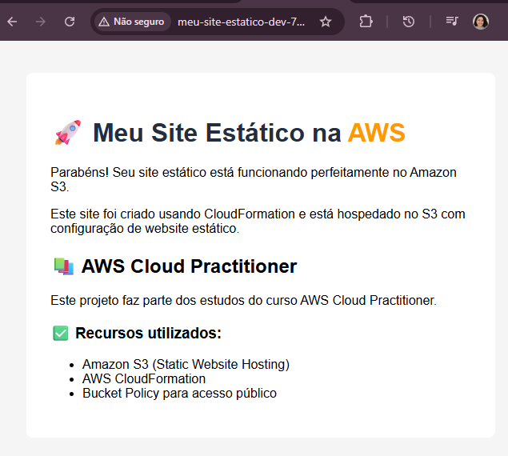

# Site Estático AWS - CloudFormation - Free Tier

Este projeto demonstra como criar e hospedar um site estático na AWS usando apenas recursos do Free Tier, com foco em automação e boas práticas de infraestrutura como código.



## 📖 O que foi desenvolvido

Um sistema completo de hospedagem de site estático que inclui:

- **Infraestrutura como Código**: Template CloudFormation para provisionamento automatizado
- **Site Responsivo**: Páginas HTML com design moderno e responsivo
- **Automação Completa**: Scripts bash para deploy, validação e limpeza
- **Monitoramento de Custos**: Validação automática do uso do Free Tier
- **Configuração de Segurança**: Políticas de bucket otimizadas para hospedagem web

## 🛠️ Tecnologias Utilizadas

### AWS Services

- **Amazon S3**: Hospedagem do site estático com configuração de website
- **AWS CloudFormation**: Infraestrutura como código para provisionamento automatizado
- **AWS CLI**: Interface de linha de comando para interação com os serviços AWS

### Desenvolvimento

- **HTML5**: Estrutura das páginas web
- **Bash**: Scripts de automação para deploy e gerenciamento

### Ferramentas

- **Git**: Controle de versão
- **CloudFormation Templates**: YAML para definição da infraestrutura
- **Responsive Design**: Layout adaptável para diferentes dispositivos

## 🎯 Características

- **Custo**: $0.00 (Free Tier)
- **Hospedagem**: Amazon S3 Static Website Hosting
- **Deploy**: CloudFormation com automação completa
- **Monitoramento**: Validação automática de limites do Free Tier
- **Segurança**: Políticas de bucket configuradas adequadamente

## 🏗️ Arquitetura da Solução

### Componentes Principais

1. **S3 Bucket**: Configurado para hospedagem de site estático

   - Website hosting habilitado
   - Políticas de acesso público para leitura
   - Configuração de páginas de índice e erro

2. **CloudFormation Stack**: Gerencia toda a infraestrutura

   - Criação automatizada do bucket S3
   - Configuração de políticas de segurança
   - Outputs com URLs de acesso

3. **Scripts de Automação**:
   - `deploy.sh`: Deploy completo da infraestrutura e conteúdo
   - `validate-freetier.sh`: Monitoramento de uso dos recursos
   - `cleanup.sh`: Remoção segura de todos os recursos

### Fluxo de Deploy

1. **Validação**: Verifica configuração da AWS CLI
2. **Infraestrutura**: Cria/atualiza stack CloudFormation
3. **Conteúdo**: Upload dos arquivos HTML para o S3
4. **Configuração**: Habilita website hosting no bucket
5. **Verificação**: Testa acesso ao site e exibe URL

## 📋 Pré-requisitos

- AWS CLI configurado (`aws configure`)
- Conta AWS com Free Tier ativo
- Bash (Git Bash no Windows)
- Permissões IAM para S3 e CloudFormation

## 🚀 Como usar

### 1. Deploy do site

```bash
./deploy.sh
```

### 2. Validar uso do Free Tier

```bash
./validate-freetier.sh
```

### 3. Limpar recursos (quando não precisar mais)

```bash
./cleanup.sh
```

## 💻 Implementação Técnica

### CloudFormation Template

O arquivo `site-estatico-template.yaml` define:

- **S3 Bucket**: Com nome único baseado em timestamp
- **Bucket Policy**: Permite acesso público de leitura
- **Website Configuration**: Índice e páginas de erro
- **Outputs**: URLs de acesso e informações do bucket

### Scripts de Automação

**deploy.sh**:

- Gera nome único para o bucket
- Cria/atualiza stack CloudFormation
- Faz upload do conteúdo HTML
- Configura permissões do bucket
- Exibe URL de acesso

**validate-freetier.sh**:

- Monitora uso de armazenamento S3
- Verifica número de requests
- Calcula transferência de dados
- Alerta sobre limites próximos

**cleanup.sh**:

- Remove todos os arquivos do bucket
- Deleta o stack CloudFormation
- Confirma remoção completa

### Páginas Web

**index.html**:

- Informações sobre AWS e Free Tier
- Links para documentação oficial

**error.html**:

- Página de erro personalizada
- Design consistente com a página principal
- Navegação de retorno

## 💰 Limites do Free Tier S3

- **Armazenamento**: 5 GB
- **Requests GET**: 20.000/mês
- **Requests PUT/POST**: 2.000/mês
- **Transferência**: 15 GB/mês
- **Monitoramento**: Incluso no Free Tier

## 📁 Estrutura do projeto

```
├── site-estatico-template.yaml  # Template CloudFormation
├── deploy.sh                    # Script de deploy
├── validate-freetier.sh         # Validação de uso
├── cleanup.sh                   # Limpeza de recursos
├── index.html                   # Página principal (criada automaticamente)
└── error.html                   # Página de erro (criada automaticamente)
```

## 🔧 Personalização

Para personalizar seu site:

1. Edite os arquivos `index.html` e `error.html`
2. Execute `./deploy.sh` novamente para atualizar

## 🎓 Aprendizados e Benefícios

### Conceitos AWS Aplicados

- **Infrastructure as Code (IaC)**: Uso do CloudFormation para versionamento da infraestrutura
- **Static Website Hosting**: Configuração otimizada do S3 para hospedagem web
- **Cost Optimization**: Implementação dentro dos limites do Free Tier
- **Security Best Practices**: Políticas de bucket com acesso mínimo necessário
- **Automation**: Scripts para deploy, monitoramento e cleanup

### Habilidades Desenvolvidas

- Criação de templates CloudFormation
- Automação com scripts bash
- Configuração de hospedagem estática no S5
- Monitoramento de custos e uso de recursos
- Desenvolvimento web responsivo

### Casos de Uso

- **Portfólios pessoais**: Sites de apresentação profissional
- **Landing pages**: Páginas de produtos ou serviços
- **Documentação**: Sites de documentação técnica
- **Blogs estáticos**: Sites gerados por ferramentas como Jekyll
- **Prototipagem**: Testes rápidos de interfaces

## ⚠️ Importante

- O nome do bucket deve ser único globalmente
- Mantenha o monitoramento do uso para não exceder o Free Tier
- Execute `./cleanup.sh` quando não precisar mais do site
- Considere usar CloudFront para melhor performance (fora do escopo Free Tier)

## 🌐 Acesso ao site

Após o deploy, o site estará disponível na URL fornecida pelo script, no formato:
`http://[bucket-name].s3-website-[region].amazonaws.com`

## 🔗 Recursos Adicionais

- [AWS S3 Static Website Hosting](https://docs.aws.amazon.com/AmazonS3/latest/userguide/WebsiteHosting.html)
- [AWS CloudFormation User Guide](https://docs.aws.amazon.com/cloudformation/)
- [AWS Free Tier](https://aws.amazon.com/free/)
- [AWS CLI Documentation](https://docs.aws.amazon.com/cli/)
